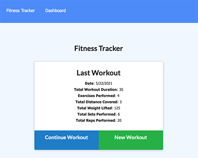
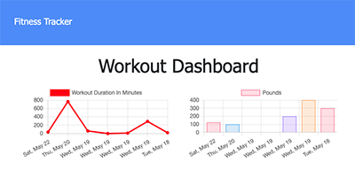

# Fitness Tracker

## Table of Contents

- [Description](#description)
- [Installation](#installation)
- [Usage](#usage)
- [License](#license)
- [Tests](#tests)
- [Links](#links)
- [Contributors](#contributors)
- [Questions](#questions)

## Description

An app that will track your resistance and cardio workouts.

## Installation

To install the required dependencies, run the following command:
npm i

## Usage

Utilizing Mongoose and MongoDB, the user can enter their exercises into the modal and charts will be created to reflect their workout.

## License

The project is licensed under the MIT license.

## Tests

Please run the following command to test:
NA

## Links

https://cryptic-beyond-93080.herokuapp.com/?id=60a92b501c338c00158d55b2

## Contributors

Callie Nipper

## Questions?

Please email callie.nipper@gmail.com with any questions.
Visit me on GitHub at https://github.com/calliebn
